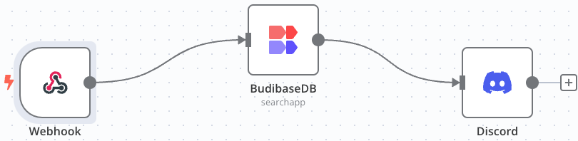

# n8n-nodes-budibasedb

Connect to your Budibase DB and perform CRUD operations on:

- Applications
- Rows
- Tables

## Required config

To get started, you will need:

- an API Key
- an App ID
- a base URL

To connect to a cloud environment, replace `tenant` with your own tenant ID.

Self-hosted users can replace `tenant.budibase.app` with their own domain.

View the [Public API](https://docs.budibase.com/docs/public-api) docs to see how to get the API Key and App ID.

## Installation

- [Install community nodes in the n8n app](https://docs.n8n.io/integrations/community-nodes/installation/gui-install/)
- [npm package](https://www.npmjs.com/package/n8n-nodes-budibasedb)

## License

[MIT](https://github.com/n8n-io/n8n-nodes-starter/blob/master/LICENSE.md)
